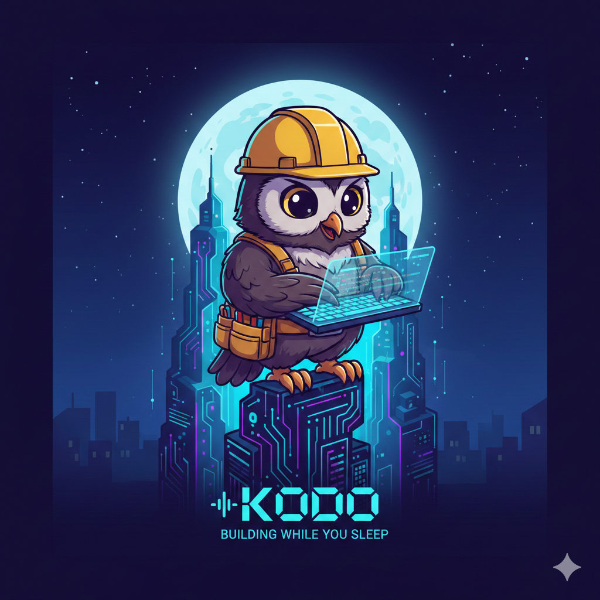

<p align="center">
  
  <br><br>
  <strong>Building while you sleep.</strong>
  <br><br>
  <a href="https://www.python.org/"></a>
  <a href="https://github.com/ikamen/kodo/blob/main/LICENSE"></a>
  <a href="https://docs.anthropic.com/en/docs/claude-code"></a>
  <a href="https://cursor.com"></a>
</p>

---

# 🦉 kodo

Autonomous multi-agent coding that runs overnight on your Claude Code Max subscription. An orchestrator directs Claude Code agents through work cycles with independent verification — so you wake up to tested, reviewed code instead of a stale terminal.

## 🎬 How it works in practice

Real run from [blackopt](https://github.com/ikamen/blackopt) — building an auto-solving meta-optimizer with 4 new algorithms, adaptive scheduling, and 73 tests. **3 hours unattended, 2 cycles, succeeded.**

```
🔍 [00:00] orchestrator → architect
           "Survey the codebase — Solver interface, existing algorithms,
            where to add new ones."
📋 [03:04] architect reports back
           Full architecture survey, found 3 bugs in existing code

🔧 [03:14] orchestrator → worker_smart
           "Fix structural bugs identified by architect"
✅ [11:29] worker_smart: 82 turns of editing. All bugs fixed, tests pass.

⚡ [12:36] orchestrator dispatches 3 agents in parallel:
           → architect:     "Analyze how to implement DE and PSO"
           → worker_fast:   "Implement TabuSearch and EDA"
           → worker_smart:  "Build autosolve() — concurrent portfolio,
                             adaptive scheduling"

🏁 [35:20] orchestrator → done("autosolve complete, 4 new algorithms")
           → tester:          runs tests ✅
           → tester_browser:  runs tests ✅
           → architect:       "ProcessPool is never closed — resource leak" ❌
           REJECTED

🔧 [45:37] orchestrator → worker_smart: "Fix the resource leak"
           → done() → architect: "class-variable contamination" ❌
           REJECTED

           ... 7 more verification rounds ...
           architect catches: time-slice state mutation, exponential
           offspring, crossover edge case — each progressively more subtle

🎉 [2:59:50] → done() → tester ✅ → tester_browser ✅ → architect ✅
             ACCEPTED — "4 new algorithms, autosolve() API, 73 tests pass"
```

The architect verifier caught **9 rounds of bugs** that the worker agent was blind to — resource leaks, class variable contamination, state mutation — each subtler than the last. A single Claude Code session would likely have shipped with several of these.

## 💤 When to use kodo

You have a Claude Code Max subscription. You can't use it while you sleep.

kodo lets you point that subscription at a goal, go to bed, and wake up to working code that's been independently tested and reviewed. The orchestrator (Gemini Flash, fractions of a cent) directs your subscription-covered Claude Code agents through multiple work cycles with built-in QA.

<table>
<tr><td nowrap>🌙 <strong>Overnight runs</strong></td><td>Set a goal, leave it running for hours. Cycles checkpoint progress automatically.</td></tr>
<tr><td nowrap>🔍 <strong>Built-in verification</strong></td><td>Independent architect + tester agents review work before accepting. Catches bugs the implementing agent is blind to.</td></tr>
<tr><td nowrap>🔄 <strong>Resume interrupted runs</strong></td><td>ctrl-C'd or crashed? <code>kodo --resume</code> picks up where it left off, with agents resuming their prior conversations.</td></tr>
<tr><td nowrap>🎭 <strong>Role separation</strong></td><td>Orchestrator making judgment calls, workers building code, independent reviewers catching issues.</td></tr>
<tr><td nowrap>🧠 <strong>Context efficiency</strong></td><td>Work is spread across multiple agent context windows, so tasks that might overwhelm a single agent's context can succeed when agents take turns with focused scopes. Not yet proven to help in practice, but architecturally sound.</td></tr>
</table>

## 🧑‍💻 When to just use Claude Code directly

<table>
<tr><td nowrap>📖 <strong>Learning</strong></td><td>You want to stay in the loop and build intuition by watching decisions unfold.</td></tr>
<tr><td nowrap>🧭 <strong>Exploration</strong></td><td>You don't know what you want yet and are discovering the shape of the solution as you go.</td></tr>
<tr><td nowrap>🎮 <strong>Steering</strong></td><td>The task needs frequent course corrections that only a human at the keyboard can provide.</td></tr>
</table>

## 📦 Install

```bash
# 1. Install uv (Python package manager) — skip if you already have it
curl -LsSf https://astral.sh/uv/install.sh | sh

# 2. Install kodo as a global CLI tool
uv tool install git+https://github.com/ikamen/kodo

# Or from a local checkout:
git clone https://github.com/ikamen/kodo && cd kodo
uv tool install .
```

That's it. `kodo` is now on your PATH.

### Prerequisites

You need **at least one** agent backend installed:

| Backend | What it does | Install |
|---------|-------------|---------|
| 🤖 [Claude Code CLI](https://docs.anthropic.com/en/docs/claude-code) | Smart workers + architect (Claude Max subscription) | `npm install -g @anthropic-ai/claude-code` |
| ⚡ [Cursor CLI](https://docs.cursor.com/agent) | Fast workers + testers (Cursor subscription) | Comes with Cursor; enable `cursor-agent` in settings |

Both are recommended. Claude Code handles complex reasoning, Cursor handles fast iteration and testing.

For the **API orchestrator** (Gemini or Claude API), set the relevant key in a `.env` file or environment:
```bash
GOOGLE_API_KEY=...     # for gemini-flash/gemini-pro orchestrator
ANTHROPIC_API_KEY=...  # for API-billed Claude orchestrator
```

## 🚀 Usage

```bash
# Interactive mode (recommended) — walks you through goal, config, launch
kodo                     # run in current directory
kodo ./my-project        # run in specific directory

# Non-interactive (for scripting)
python -m kodo.main goal.md ./my-project --mode saga --max-cycles 3

# Resume an interrupted run (looks in project's .kodo/logs/)
kodo --resume                       # resume latest incomplete run in current dir
kodo ./my-project --resume          # resume latest in specific project
kodo --resume 20260218_205503       # resume specific run by ID
```

The interactive CLI will:
1. Ask for your goal (or reuse an existing `goal.md`)
2. Optionally refine it via a Claude interview
3. Let you pick mode, orchestrator, and limits
4. Show a summary and ask for confirmation before starting
5. Print a live progress table as agents work

> **⚠️ Heads up:** agents run with full permissions (`bypassPermissions` mode). They primarily work in your project directory but **can access any file on your system** (installing dependencies, editing configs, etc.). Make sure you have a git commit or backup before launching.

## 🏗️ Architecture

```
🦉 Orchestrator (Gemini Flash — fractions of a cent)
 │
 ├── 🔍 architect        Survey codebase, review code, find bugs
 ├── 🧠 worker_smart     Complex implementation (Claude Code)
 ├── ⚡ worker_fast       Quick tasks, iterations (Cursor)
 ├── 🧪 tester           Run tests, verify behavior
 └── 🌐 tester_browser   Browser-based UI testing
```

```
kodo/
  cli.py                     Interactive CLI (goal input → config → launch)
  agent.py                   Agent (prompt + session → run())
  sessions/
    base.py                  Session protocol, QueryResult, SessionStats
    claude.py                ClaudeSession (claude-agent-sdk, persistent)
    cursor.py                CursorSession (cursor-agent CLI, persistent)
  orchestrators/
    base.py                  Orchestrator protocol, CycleResult, RunResult
    api.py                   ApiOrchestrator (Pydantic AI — Anthropic, Gemini)
    claude_code.py           ClaudeCodeOrchestrator (Claude Code + MCP)
  log.py                     JSONL structured logging + live stats
  viewer.py / viewer.html    Browser-based log viewer
```

**Key concepts:**

- **Session** — a stateful conversation with a backend (Claude or Cursor). Tracks token usage, supports reset.
- **Agent** — a prompt + session + turn budget. Call `agent.run(task, project_dir)` to get work done.
- **Orchestrator** — an LLM that delegates to a team of agents via tool calls:
  - `ClaudeCodeOrchestrator` — runs on Claude Code with agents as MCP tools. Free on Max subscription.
  - `ApiOrchestrator` — runs on Anthropic/Gemini API. Pay-per-token orchestrator, but workers still use your subscription.
- **Cycle** — one unit of orchestrated work. Think of it as one dev session.
- **Run** — multiple cycles until done, with summaries bridging context between cycles.

## 💰 Cost tracking

Kodo tracks costs in two buckets:

| Bucket | What | Example |
|--------|------|---------|
| **🔑 API** | Real money — pay-per-token orchestrator calls | Gemini Flash orchestrator: ~$0.13/run |
| **✨ Virtual** | **Not charged.** Claude Code SDK reports what API usage *would* cost — but on a Max/Pro subscription you pay nothing extra. | Claude Max workers: shows ~$1.69, actual spend $0 |

The progress table labels subscription-covered costs as **Virtual** to make this clear. Only the **API** bucket represents real spend.

## 🔎 Analyzing past runs

```bash
# Open the interactive HTML viewer
python -m kodo.viewer .kodo/logs/20260218_205503.jsonl

# Or get a text summary
python analyze_run.py .kodo/logs/*.jsonl
```

## 🐍 Programmatic usage

```python
from kodo import Agent
from kodo.sessions.claude import ClaudeSession
from kodo.orchestrators.claude_code import ClaudeCodeOrchestrator

session = ClaudeSession(model="sonnet")
team = {
    "worker": Agent(session, "Implement the task given to you.", max_turns=30),
    "reviewer": Agent(ClaudeSession(model="sonnet"), "Review for bugs.", max_turns=10),
}

orch = ClaudeCodeOrchestrator(model="opus")
result = orch.run("Build a REST API for todos", project_dir, team, max_cycles=3)
```
